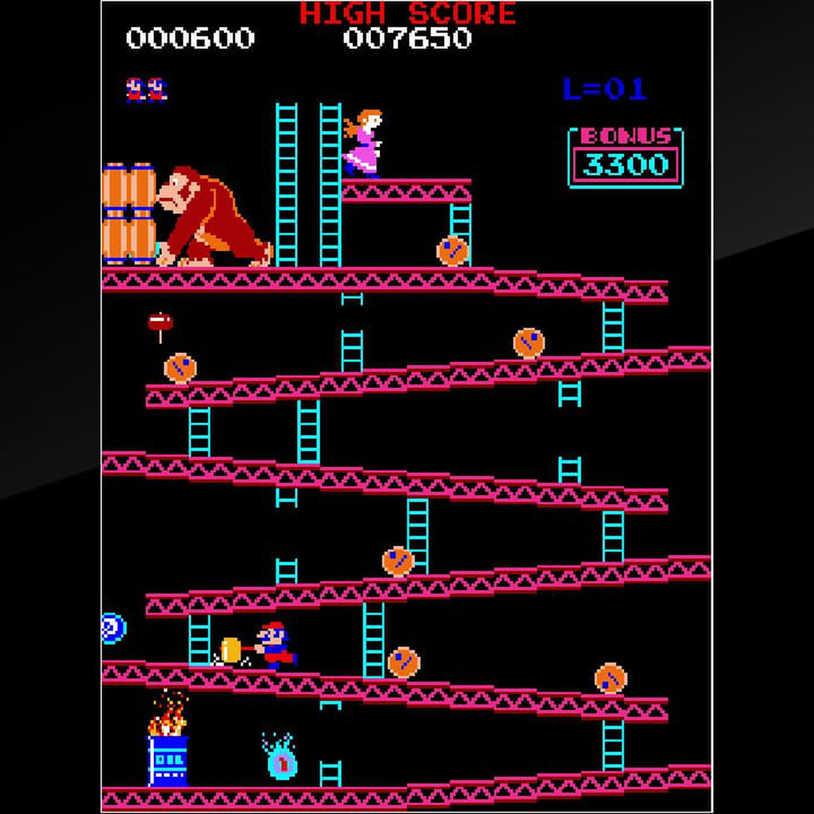
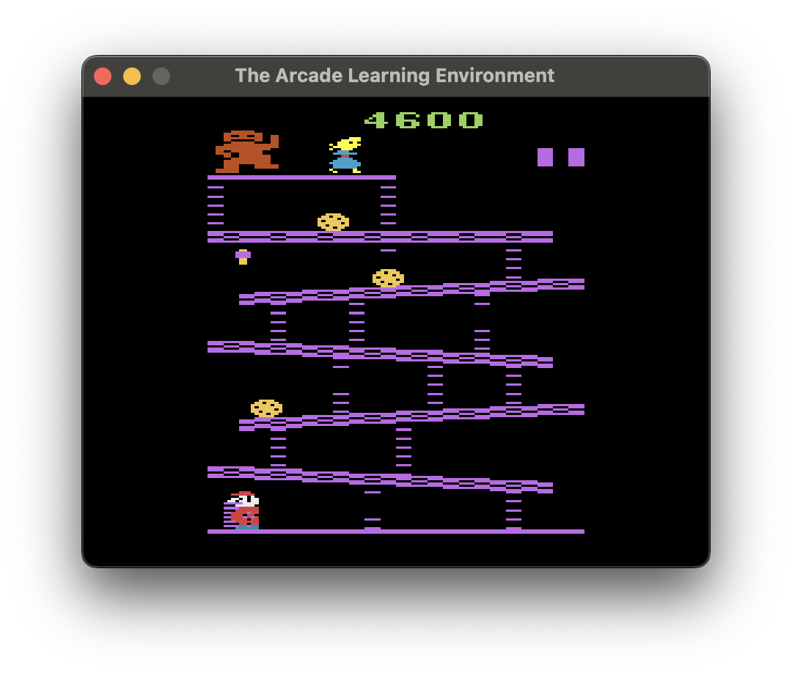

<!-- problem i tried to solve -->

For my final project, I explored the area of reinforcement learning. Specifically, I trained a model to play the original _Donkey Kong_. _Donkey Kong_ is a 1981 arcade game in which the player controls Jumpman (later to be renamed Mario), who must rescue the captured Pauline (a different character than Princess Peach), who has been kidnapped by the titular Donkey Kong. A screenshot of the first level of _Donkey Kong_ can be seen in figure \ref{dk_arcade}.

{ width=80% }

The player can receive points in three ways on the first level: 1) by jumping over a barrel (100 points) or multiple barrels at once (300 points); 2) by hitting a barrel with a hammer (800 points); 3) by reaching the top of the stage and rescuing Pauline (more points the faster the player does so, but usually about 3000). If a barrel runs into the player, the player loses a life (they start with three). Barrels will normally roll down the sloped parts of the stage, but can also randomly fall down ladders instead. Jumpman reaches the top by climbing the non-broken ladders.

In order to actually teach a model to play this game, the model needs to be able to interact with the game, which is not feasible for me to do with an actual arcade cabinet. Fortunately, the [Arcade Learning Environment](https://github.com/Farama-Foundation/Arcade-Learning-Environment) (which uses the [Stella](https://stella-emu.github.io/) Atari 2600 simulator) provides premade environments wrapping the simulated version of Donkey Kong for the Atari 2600. This allowed me to avoid attempting to reimplement _Donkey Kong_ from scratch. However, this approach does have its downsides.

First, the Atari 2600 port of _Donkey Kong_ is simply not very good. When I told my father (an expert in the classic arcade game repair community) that I was using a ported version of _Donkey Kong_, his first words were "I hope not the Atari 2600 version!" In the process of training and testing, I played the game repeatedly, and it really is just a poor replica. Near-perfect precision is required to climb the ladders, some functionality is missing (the blue barrel), and worse, other bits are there but broken (on the second stage, what the player sees is not an accurate representation of the state of the game, so they can die by walking over what appears to be safe ground). Compare the screenshot of the arcade _Donkey Kong_ with figure \ref{dk_2600}, which is the first level in the Atari 2600 port of _Donkey Kong_.

{ width=80% }

Second, using the premade environment means that the reward function is predetermined. In the case of Donkey Kong, the reward function was defined as the game's score. Though this may be more accurate to a human playing the game, it means that the model will almost definitely never learn to beat a level. The reason for this is that, as noted above, the player only scores points by making it all the way to the top --- that is, there is no partial reward for making it say, halfway to the top. In practical terms, this means that the model would need to have a perfect game essentially by chance in order to get a reward that entices it to attempt to follow a similar path. Were I to define the rewards for this game, I would give the model minuscule rewards based on how high it got on the screen --- perhaps 1 point each each time it sets a new per-life record for height. This would reward the model for climbing ladders and going up slopes, hopefully letting it reach the goal and Pauline.

<!-- TODO: background reading -->

Reinforcement learning is a general category of deep learning. Essentially, it refers to a model which learns to do something by trying random actions until some are more successful than others (i.e., receive a higher reward). This is in contrast to imitation learning, in which a model attempts to mimic a "known good" player. As reinforcement learning is so general, there are many specific strategies that fall under that classification. Some examples include Deep Q Learning (DQN), Double Deep Q Learning (DDQN), Actor-Critic, Advantage Actor-Critic (A2C), Proximal Policy Optimization (PPO), Soft Actor-Critic (SAC), Deep Deterministic Policy Gradient (DDPG), Twin Delayed DDPG (TD3), and many more.

There are also various enhancements that can apply to more than one of these strategies, such as using a replay buffer (which stabilizes learning while also preventing "catastrophic forgetting," which can result in a model forgetting how to beat the first level of a game as it learns to solve the second level), or a fixed Q-target (which also serves to prevent oscillation).

Modifications can also be made to the environment itself, such as sticky actions (a probability that the last action taken will repeat), frame skipping, etc. One environment modification that I ended up using was frame stacking, which essentially makes it so that the model sees the four most recent frames rather than only the current frame. The problem this solves is one of momentum: imagine that Jumpman is mid-jump. Based solely on one frame, can you tell whether he is going up or down? Frame stacking solves this problem, making games like _Donkey Kong_ actually playable, though it is unnecessary for simpler environments.

<!-- what i implemented and why -->

I implemented reinforcement learning with three strategies: Deep Q Learning, Double Deep Q Learning, and Advantage Actor-Critic (nonfunctional). These range from nearly the simplest form of Q-learning (the only one simpler is non-deep ("shallow") Q-learning, which is unfeasible in an environment as complex as _Donkey Kong_) to a moderately complex strategy. My original plan was to train models using each strategy, and then present them alongside a player who picks actions randomly and a human player (myself), but this was limited by my issues with A2C.

<!-- how well it worked and how i measured it -->

The success of my models can be measured in two ways: quantitatively and qualitatively. These correspond to: judging only by the score at the end of the game (quantitative); or watching the model play and using my opinion (qualitative). I went with a mix of two. My estimation process was as follows:

1. Run the model on a randomly-seeded instance of the game. If it takes a silly strategy (running all the way to the left or all the way to the right, without jumping), treat that model as a failure.
2. Now that the model is doing something interesting (I only saw jumping, but climbing ladders would fit into this category as well), run the same model on instances of the game seeded from 1 to 100, storing the rewards.
3. Take the models with the best rewards (the best I saw was 400) and watch them for something impressive (the best I saw was a model that managed to jump over two barrels in the same life without dying, before dying while jumping over the third barrel).

As expected, none of the models I trained learned how to beat the first level. However, I did see some models that learned how to repeatedly jump over barrels and survive. I suspect that more training time and/or tuning would increase the models' skill at this strategy. The strategy in question is effective, though not perfect, since the player dies when the time runs out.

\pagebreak

\begin{center}
\textbf{References}
\end{center}

- <https://stable-baselines3.readthedocs.io/en/master>
- <https://huggingface.co/learn/deep-rl-course/en>
- <https://github.com/deepanshut041/Reinforcement-Learning>
- <https://github.com/vwxyzjn/cleanrl>

seed 53
seed 60

SEED 27
